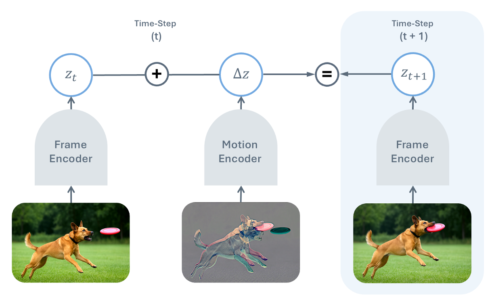
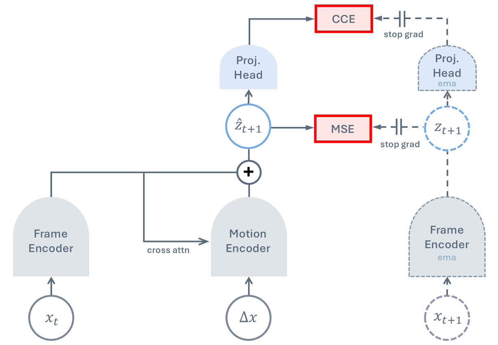

# 🎬 You Don't Need Strong Assumptions: Temporal Difference Visual Representation Learning

📚 [Paper](https://temporal-difference-vision.github.io/static/pdfs/TDV-arxiv.pdf) | 🌐 [Website](https://temporal-difference-vision.github.io/) | 🧾 [Bibtex](#citation)

**Ninad Daithankar\*, Alexi Gladstone\*, Yann LeCun, Heng Ji** &nbsp;(\*Equal Contribution)  
University of Illinois Urbana-Champaign &nbsp;·&nbsp; New York University




TDV is a self-supervised video representation learning method built on a single causal assumption: **the past causes the future**. A frame encoder and motion encoder are trained jointly such that the current frame's representation plus the encoded motion equals the next frame's representation — no augmentations, masking, or cropping required. TDV matches DINO, iBOT baselines on segmentation tasks and surpasses them on optical flow and stereo depth.


## Setup

Create a conda environment and install dependencies:

```bash
conda create -n tdv python=3.11
conda activate tdv
pip install -r requirements.txt
```

> **GH200 / aarch64 clusters:** standard PyTorch wheels don't work out of the box. Follow the steps in [requirements/readme.md](requirements/readme.md) and use `requirements/gh200.txt` instead.

Set environment variables:

```bash
export HF_HOME=/path/to/cache
export HF_TOKEN=your_token_here  # may not be needed
```

Login to wandb:

```bash
wandb login
```

For dataset setup see [data/cv/README.md](data/cv/README.md).

## General Code Flow

The job script passes all hyperparameters to `train_model.py`. It handles seeding, distributed training setup (DDP), wandb initialization, callback registration (KNN eval, linear probes, DeepSORT tracking), and then calls `trainer.fit()`.

`train_model.py` instantiates `ModelTrainer` from `base_model_trainer.py` — the PyTorch Lightning module responsible for the training loop, validation, optimizer/scheduler setup, gradient logging, and EMA updates. 

### Model Architecture: [model/cv/tdv/tdv.py](model/cv/tdv/tdv.py)



The core model is `TDV`, defined in [`model/cv/tdv/tdv.py`](model/cv/tdv/tdv.py). It implements the temporal difference objective end-to-end and is self-contained — if you only need the architecture and loss, this is the only file you need. 

All hyperparameters live in `hparams/args.py`. Generally you should not need to touch `train_model.py` or `base_model_trainer.py` — new experiments come from adding model variants in `model/cv/` and new datasets in `data/cv/`.

## Running the Code

### Training

Set `RUN_NAME`, `aggr_dataset_dirs`, and `wandb_project` in [job_scripts/pretrain_tdv.slurm](job_scripts/pretrain_tdv.slurm), then run directly or submit to a cluster:

```bash
# Local / debugging — runs with bash
bash job_scripts/pretrain_tdv.slurm

# HPC cluster — prepends a cluster-specific header and submits with sbatch
bash slurm_executor.sh <cluster_name> job_scripts/pretrain_tdv.slurm
```

The job scripts contain resource `#SBATCH` directives (nodes, GPUs, time) that are the same across clusters. Cluster-specific settings — partition names, account strings, constraints — live in separate header files under [job_scripts/slurm_headers/](job_scripts/slurm_headers/). `slurm_executor.sh` prepends `job_scripts/slurm_headers/<cluster_name>.slurm` to the job script and submits the combined file via `sbatch`. This keeps job scripts cluster-agnostic: to add a new cluster, just add a header file. Every submission is also logged to `logs/job_scripts/executed_slurm_script_contents.log` for easy resubmission.

For a full list of arguments see `hparams/args.py`. For debugging, add `--debug_mode` (disables wandb, enables anomaly detection, limits batches) or `--no_wandb` to log to `logs/console.log` instead.

### Evaluation

#### Linear Probe (SSv2 / ImageNet)

Trains a linear classifier on top of the frozen TDV frame encoder. Frames are pooled via CLS token and optionally concatenated across a short clip. Set `CHECKPOINT_PATH`, `DATASET_DIR`, and the dataset-specific variables at the top of [job_scripts/eval/linear_probe.slurm](job_scripts/eval/linear_probe.slurm) — the script covers both SSv2 and ImageNet.

#### Optical Flow (Sintel)

Uses a Midway decoder ([IterativeLatentMotion](eval/flow/croco/models/latent_motion.py) + DPT head) trained on top of the frozen TDV encoder. The flow eval code lives in [eval/flow/](eval/flow/) and is adapted from the [CroCo v2](https://github.com/naver/croco) stereoflow codebase. See [eval/flow/README.md](eval/flow/README.md) for full setup and dataset download instructions. Set `REPO_ROOT`, `CHECKPOINT`, and the three `dataset_dirs` paths in [job_scripts/eval/flow_eval.slurm](job_scripts/eval/flow_eval.slurm).

#### Stereo Depth (SceneFlow)

Uses the same Midway decoder as optical flow, but in stereo mode (`stereo` subcommand). Set `REPO_ROOT`, `CHECKPOINT`, and `SceneFlow` dataset path in [job_scripts/eval/stereo_depth_eval.slurm](job_scripts/eval/stereo_depth_eval.slurm).

#### Semantic Segmentation (ADE20K / Cityscapes)

Uses a UPerNet decode head on top of the frozen TDV encoder, implemented via the mmsegmentation fork in [repos/mmsegmentation-tdv](repos/mmsegmentation-tdv). The TDV frame encoder is exposed as a drop-in mmseg backbone (`TDVBackbone`) that extracts multi-scale intermediate features. Set `tdv_repo_path` and `data_root` in the config before running (see the repo's README for installation):

```bash
cd repos/mmsegmentation-tdv
python tools/train.py configs/tdv/tdv-base_upernet_160k_ade20k-512x512.py \
  --cfg-options model.backbone.checkpoint_path=/path/to/checkpoint.ckpt \
                model.backbone.tdv_repo_path=/path/to/tdv-clean
```

## Repo Structure

```
tdv-clean/
├── train_model.py                          # entry point — parses hparams, sets up DDP, calls trainer
├── base_model_trainer.py                   # PyTorch Lightning module — training loop, optimizer, logging
├── hparams/args.py                         # all hyperparameters
├── model/
│   └── cv/
│       ├── tdv/tdv.py                      # TDV — main model
│       └── dinov2/                         # DINOv2 ViT encoder
├── data/cv/                                # dataloaders (SSv2, Ego4D, FineVideo, Kinetics, ...)
├── eval/
│   ├── flow/                               # optical flow eval (Sintel) — Midway decoder
│   ├── probes/                             # linear probe eval
│   ├── knn/                                # KNN eval
│   └── tracking/                           # DeepSORT tracking eval
├── repos/
│   ├── dino-with-online-knn/               # DINO training with online KNN monitoring
│   ├── ibot-with-online-knn/               # iBOT training with online KNN monitoring
│   └── mmsegmentation-tdv/                 # mmseg fork with TDVBackbone for segmentation eval
├── job_scripts/
│   ├── pretrain_tdv.slurm                  # pretraining launch script
│   ├── slurm_headers/                      # cluster-specific SBATCH headers
│   └── eval/
│       ├── linear_probe.slurm              # linear probe eval (SSv2 / ImageNet)
│       ├── flow_eval.slurm                 # optical flow eval (Sintel / FlyingThings / Chairs)
│       └── stereo_depth_eval.slurm         # stereo depth eval (SceneFlow)
├── requirements.txt
└── slurm_executor.sh
```

## Citation

If you find this repo useful, please consider giving a star ⭐ and a citation 🙃. If you have any questions, feel free to post them on github issues, hugging face daily papers, or email me (ninaddaithankar@gmail.com).

```bibtex
@inproceedings{daithankar2026tdv,
  title={You Don't Need Strong Assumptions: Visual Representation Learning via Temporal Differences},
  author={Daithankar, Ninad and Gladstone, Alexi and LeCun, Yann and Ji, Heng},
  booktitle={Advances in Neural Information Processing Systems},
  year={2026},
  url={https://temporal-difference-vision.github.io}
}
```
