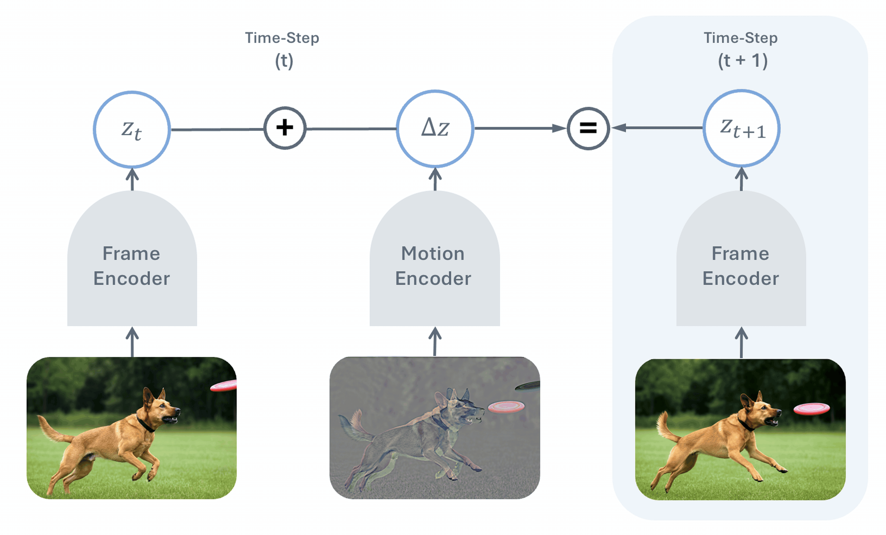

# 🎬 You Don't Need Strong Assumptions: Temporal Difference Visual Representation Learning

📚 [Paper](https://temporal-difference-vision.github.io/static/pdfs/TDV-arxiv.pdf) | 🌐 [Website](https://temporal-difference-vision.github.io/) | 🧾 [Bibtex](#citation)

**Ninad Daithankar\*, Alexi Gladstone\*, Yann LeCun, Heng Ji** &nbsp;(\*Equal Contribution)  
University of Illinois Urbana-Champaign &nbsp;·&nbsp; New York University




TDV is a self-supervised video representation learning method built on a single causal assumption: **the past causes the future**. A frame encoder and motion encoder are trained jointly such that the current frame's representation plus the encoded motion equals the next frame's representation — no augmentations, masking, or cropping required. TDV matches DINO, iBOT baselines on segmentation tasks and surpasses them on optical flow and stereo depth.


## Setup

Create a conda environment and install dependencies:

```bash
conda create -n tdv python=3.11
conda activate tdv

pip install torch==2.10.0+cu126 torchaudio torchvision --index-url https://download.pytorch.org/whl/cu126  # PyTorch (CUDA 12.6) — works on both x86_64 and aarch64/GH200

conda install -c conda-forge aiohttp libiconv ffmpeg -y  # aiohttp==3.8.1 can't compile from source on Python 3.11; conda provides a compatible binary

pip install -r requirements.txt --no-deps  # --no-deps avoids conflicts while downloading dependencies
```

Set environment variables:

```bash
export HF_HOME=/path/to/cache
export HF_TOKEN=your_token_here  # may not be needed
```

Login to wandb:

```bash
wandb login
```

For dataset setup see [data/cv/README.md](data/cv/README.md).

## General Code Flow

The job script passes all hyperparameters to `train_model.py`. It handles seeding, distributed training setup (DDP), wandb initialization, callback registration (KNN eval, linear probes, DeepSORT tracking), and then calls `trainer.fit()`.

`train_model.py` instantiates `ModelTrainer` from `base_model_trainer.py` — the PyTorch Lightning module responsible for the training loop, validation, optimizer/scheduler setup, gradient logging, and EMA updates. 

### Model Architecture: [model/cv/tdv/tdv.py](model/cv/tdv/tdv.py)


The core model is `TDV`, defined in [`model/cv/tdv/tdv.py`](model/cv/tdv/tdv.py). It implements the temporal difference objective end-to-end and is self-contained — if you only need the architecture and loss, this is the only file you need. 

All hyperparameters live in `hparams/args.py`. Generally you should not need to touch `train_model.py` or `base_model_trainer.py` — new experiments come from adding model variants in `model/cv/` and new datasets in `data/cv/`.

## Running the Code

### Training

#### Running locally

In [job_scripts/pretrain_tdv.slurm](job_scripts/pretrain_tdv.slurm), set:

| Field | Location | What to set |
|---|---|---|
| `RUN_NAME` | `export RUN_NAME=` | name for this run (used in logs and wandb) |
| `--aggr_dataset_dirs` | `ARGS` block | path(s) to your dataset(s) |
| `--wandb_project` | `ARGS` block | your wandb project name |
| `--gpus` | `ARGS` block | e.g. `"[0]"` for single GPU, `"[0, 1]"` for two (default is -1 which uses all GPUs) |
| `--knn_eval_data_dir` | `ARGS` block | path to your ImageNet folder if downloaded elsewhere |

Then run:

```bash
bash job_scripts/pretrain_tdv.slurm
```

For debugging, also add `--debug_mode` to the `ARGS` block — it disables wandb, enables anomaly detection, and limits batches. Or add `--no_wandb` to skip wandb without the other debug constraints.

#### Running on a cluster (SLURM)

**1. Set run-specific fields** in [job_scripts/pretrain_tdv.slurm](job_scripts/pretrain_tdv.slurm) — same as above (`RUN_NAME`, `--aggr_dataset_dirs`, `--wandb_project`, `--knn_eval_data_dir`). 

Then, update the `#SBATCH` header lines at the top of the file:

| Field | What to set |
|---|---|
| `#SBATCH --job-name` | same as `RUN_NAME` |
| `#SBATCH --output` | log path, e.g. `logs/slurm/YOUR_RUN_NAME` |
| `#SBATCH --nodes` | number of nodes |
| `#SBATCH --gpus-per-node` | GPUs per node |
| `#SBATCH --time` | wall time limit |

**2. Set cluster-specific settings** in your cluster's header file under [job_scripts/slurm_headers/](job_scripts/slurm_headers/) (copy `example_gh200.slurm` to `<cluster_name>.slurm`):

| Field | What to set |
|---|---|
| `#SBATCH --account` | your cluster account/allocation |
| `#SBATCH --partition` | partition name for your cluster |

**3. Submit:**

Make sure the `tdv` conda environment is activated before submitting — SLURM inherits it from the shell that calls `sbatch`.

```bash
conda activate tdv
bash slurm_executor.sh <cluster_name> job_scripts/pretrain_tdv.slurm
```

`slurm_executor.sh` prepends `job_scripts/slurm_headers/<cluster_name>.slurm` to the job script and submits via `sbatch`. To add a new cluster, just add a header file. Every submission is logged to `logs/job_scripts/executed_slurm_script_contents.log`.

---

For a full list of training arguments see `hparams/args.py`.

### Evaluation

#### Linear Probe (SSv2 / ImageNet)

Trains a linear classifier on top of the frozen TDV frame encoder. Frames are pooled via CLS token and optionally concatenated across a short clip. Set `CHECKPOINT_PATH`, `DATASET_DIR`, and the dataset-specific variables at the top of [job_scripts/eval/linear_probe.slurm](job_scripts/eval/linear_probe.slurm) — the script covers both SSv2 and ImageNet.

#### Optical Flow (Sintel)

Uses a Midway decoder ([IterativeLatentMotion](eval/flow/croco/models/latent_motion.py) + DPT head) trained on top of the frozen TDV encoder. The flow eval code lives in [eval/flow/](eval/flow/) and is adapted from the [CroCo v2](https://github.com/naver/croco) stereoflow codebase. See [eval/flow/README.md](eval/flow/README.md) for full setup and dataset download instructions. Set `REPO_ROOT`, `CHECKPOINT`, and the three `dataset_dirs` paths in [job_scripts/eval/flow_eval.slurm](job_scripts/eval/flow_eval.slurm).

#### Stereo Depth (SceneFlow)

Uses the same Midway decoder as optical flow, but in stereo mode (`stereo` subcommand). Set `REPO_ROOT`, `CHECKPOINT`, and `SceneFlow` dataset path in [job_scripts/eval/stereo_depth_eval.slurm](job_scripts/eval/stereo_depth_eval.slurm).

#### Semantic Segmentation (ADE20K / Cityscapes)

Uses a UPerNet decode head on top of the frozen TDV encoder, implemented via the mmsegmentation fork in [repos/mmsegmentation-tdv](repos/mmsegmentation-tdv). The TDV frame encoder is exposed as a drop-in mmseg backbone (`TDVBackbone`) that extracts multi-scale intermediate features. Set `tdv_repo_path` and `data_root` in the config before running (see the repo's README for installation):

```bash
cd repos/mmsegmentation-tdv
python tools/train.py configs/tdv/tdv-base_upernet_160k_ade20k-512x512.py \
  --cfg-options model.backbone.checkpoint_path=/path/to/checkpoint.ckpt \
                model.backbone.tdv_repo_path=/path/to/tdv-clean
```

## Repo Structure

```
tdv/
├── train_model.py                          # entry point — parses hparams, sets up DDP, calls trainer
├── base_model_trainer.py                   # PyTorch Lightning module — training loop, optimizer, logging
├── hparams/args.py                         # all hyperparameters
├── model/
│   └── cv/
│       ├── tdv/tdv.py                      # TDV — main model
│       └── dinov2/                         # DINOv2 ViT encoder
├── data/cv/                                # dataloaders (SSv2, Ego4D, FineVideo, Kinetics, ...)
├── eval/
│   ├── flow/                               # optical flow eval (Sintel) — Midway decoder
│   ├── probes/                             # linear probe eval
│   ├── knn/                                # KNN eval
│   └── tracking/                           # DeepSORT tracking eval
├── repos/
│   ├── dino-with-online-knn/               # DINO training with online KNN monitoring
│   ├── ibot-with-online-knn/               # iBOT training with online KNN monitoring
│   └── mmsegmentation-tdv/                 # mmseg fork with TDVBackbone for segmentation eval
├── job_scripts/
│   ├── pretrain_tdv.slurm                  # pretraining launch script
│   ├── slurm_headers/                      # cluster-specific SBATCH headers
│   └── eval/
│       ├── linear_probe.slurm              # linear probe eval (SSv2 / ImageNet)
│       ├── flow_eval.slurm                 # optical flow eval (Sintel / FlyingThings / Chairs)
│       └── stereo_depth_eval.slurm         # stereo depth eval (SceneFlow)
├── requirements.txt
└── slurm_executor.sh
```

## Citation

If you find this repo useful, please consider giving a star ⭐ and a citation 🙃. If you have any questions, feel free to post them on github issues, hugging face daily papers, or email me (ninaddaithankar@gmail.com).

```bibtex
@article{daithankar2025tdv,
  title={You Don't Need Strong Assumptions: Visual Representation Learning via Temporal Differences},
  author={Daithankar, Ninad and Gladstone, Alexi and LeCun, Yann and Ji, Heng},
  journal={arXiv preprint arXiv:XXXX.XXXXX},
  year={2025},
  url={https://temporal-difference-vision.github.io}
}
```
